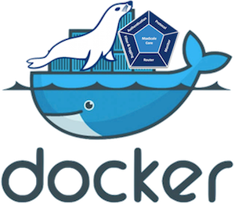

<div align="center" id="top"> 
  
  &#xa0;
</div>

<h1 align="center">Database</h1>

<h4 align="center">
	🚧  Database 🚀 Under construction...  🚧
</h4>
<hr>
<p align="center">
  <a href="#dart-about">About</a> &#xa0; | &#xa0; 
  <a href="#sparkles-features">Features</a> &#xa0; | &#xa0;
  <a href="#rocket-technologies">Technologies</a> &#xa0; | &#xa0;
  <a href="#checkered_flag-starting">Starting</a> &#xa0; | &#xa0;
  <a href="#memo-license">License</a> &#xa0; | &#xa0;
  <a href="https://github.com/GuillermoParedes" target="_blank">Author</a>
</p>

<br>

## :dart: About

That project has a docker-compose configuration.

## :sparkles: Features

- Volumens
- Configuration into WSL2 with Ubuntu, but if you can use to Linux.

## :rocket: Technologies

The following tools were used in this project:

- [Docker](https://docs.docker.com/get-docker/)
- [Docker-Compose](https://docs.docker.com/compose/install/)
- [WSL2](https://docs.microsoft.com/en-us/windows/wsl/install-win10/)
- [Docker Desktop](https://www.docker.com/products/docker-desktop/)
- [Maria DB](https://downloads.mariadb.org/)

## :checkered_flag: Starting

```bash
# Clone this project
$ git clone http://173.249.47.238:7777/gddev/docker-database

# Access
$ cd docker-database

# Run the project
$ docker-compose up

```

## :memo: License

This project is under license from MIT. For more details, see the [LICENSE](LICENSE.md) file.

Made with :heart: by <a href="https://github.com/GuillermoParedes" target="_blank">Codevs</a>

&#xa0;

<a href="#top">Back to top</a>
